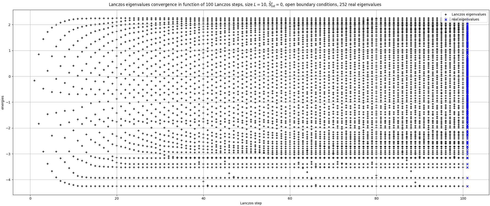

# Heisenberg Model

## Requirements:

Code was developed to run on `Python 3.9.13`. All necessary packages are in [`requirements.txt`](./requirements.txt) and [`Pipfile`](./Pipfile).

## Project Structure

<ul>
    <li>The most important file is <i>HamiltonianClass.py</i>. It contains two classes: <i>Hamiltonian</i> and <i>QuantumState</i> inherits from it. Both allow to run all necessary calculations.</li>
    <li>The mechanism of both classes is described in detail in <i>ModelDescription.ipynb</i>. It is recommended to read it through to get familiar with all simulations.</li>
    <li><i>OperatorFunctions.py</i> and <i>CommonFunctions.py</i> contain all other functions needed to support efficient way of implementing equations into the code.</li>
    <li>Project has 8 different simulations. We list type, description file and script to run below:

- Energy Gap
- Specific Heat
- Mean Energy
- Time Evolution
- Linear Response
- Perturbation
- Lanczos Step
- Lanczos Convergence</li>

<li>Each simulations has its own directory. Inside we have:

- Jupyter Notebook file with simulation's detailed description and theoretical introduction
- Python file containing the script generating graphs and printing results. All parameters are defined inside it and it should be run directly.
- 'results' directory containing .json file with all calculated data. If you run script with the same parameters, it will ask for confirmation to redo the simulation.
- 'images' directory with all generated graphs after the simulation was done.
</li>
</ul>

## Images

## Further goals

<ul>

<li>LinearResponse can be optimized better</li>
<li>Use Lanczos method to simulate larger systems</li>
<li>Manage all projects from one main.py</li>
<li>Replace pyarma with numpy</li>
<li>Add graphs for bigger L in .ipynb files</li>
<li>Create GUI to choose and run each simulation</li>
</ul>

